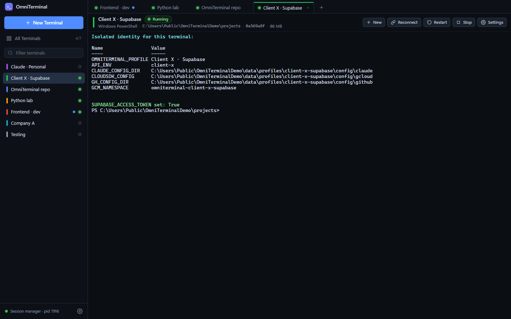
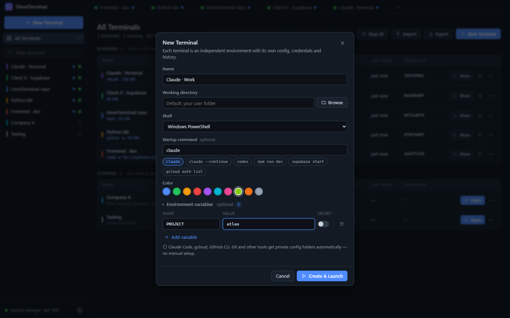
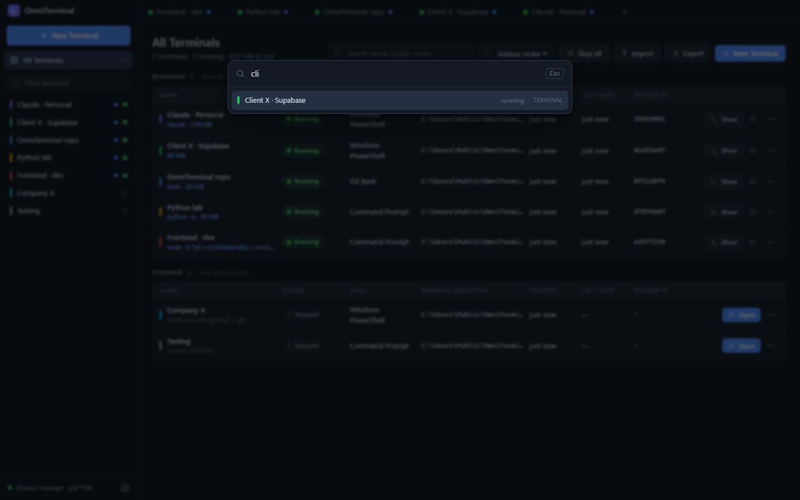
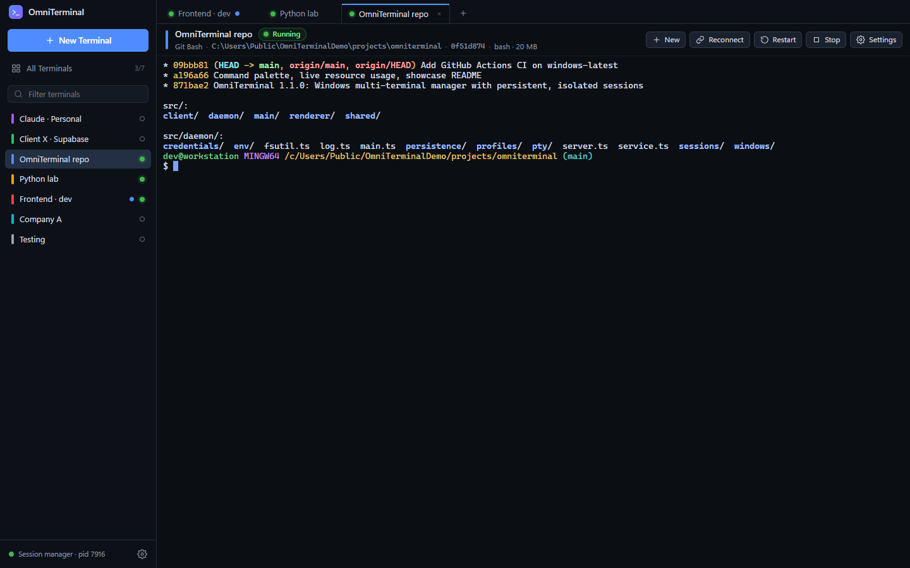
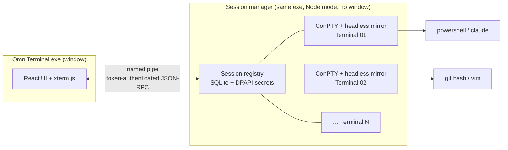

<div align="center">


# OmniTerminal

**Run unlimited terminals on Windows, each with its own identity, and keep them running after you close the window.**

Separate Claude Code, gcloud, GitHub, Git, Supabase and cloud logins per terminal ·
real ConPTY terminals · sessions that keep running when the window closes · no sandbox, full access to your machine

[](https://github.com/shklala/omniterminal/actions/workflows/ci.yml)
[](https://github.com/shklala/omniterminal/releases/latest)


[](LICENSE)

[**Download for Windows**](https://github.com/shklala/omniterminal/releases/latest) · [Features](#features) · [How it works](#how-it-works) · [Isolation matrix](#isolation-matrix) · [Build from source](#build-from-source)


</div>

---

## Why

If you use more than one account (personal and work Claude, client A's and client B's Google Cloud, two GitHub
identities), logging in from one terminal usually logs in **every** terminal. Logins are written to one shared place in
your user folder.

OmniTerminal makes **one terminal = one independent environment**. Each terminal gets its own:

* config and login folders for Claude Code, gcloud, GitHub CLI, Git, Azure, AWS, kubectl, npm, Codex and more
* environment variables, with secrets encrypted by Windows DPAPI
* shell history (PowerShell, Bash, Node and Python REPLs)
* working directory, shell, startup command and appearance

Terminals are **not sandboxed**. They run as you, with full access to your drives, repos, Docker, WSL, SSH and every
installed tool, just like Windows Terminal.

And because a small background **session manager** owns the terminals, you can **close the window while `claude` is mid-task,
reopen it later and pick up exactly where you left off**, full-screen apps included.

## Features

<table>
<tr>
<td width="50%" valign="top">

### Real terminals
ConPTY pseudoconsoles rendered by xterm.js with WebGL. Colors, Unicode, mouse, resize, scrollback, tab completion
and full-screen TUIs: `claude`, `vim`, `htop`, `ssh`, `npm`, `python`, `gcloud`, `gh`.
Not a fake text box that executes commands.

### Persistent sessions
Close the GUI and your terminals keep running. Reopen it and it **auto-reconnects** and restores each screen exactly,
from a server-side terminal mirror. If the GUI crashes, terminals live on. If the session manager crashes, it restarts
and cleans up leftover processes safely.

### Isolated identities
Per-terminal config folders via each tool's own env var, a separate Git Credential Manager
namespace per terminal, and encrypted per-terminal **tokens** for Supabase, GitHub, Netlify, Fly.io and Cloudflare.
Limitations are listed honestly in the app ([matrix below](#isolation-matrix)).

</td>
<td width="50%" valign="top">

### Built for many terminals at once
No artificial limit. Each terminal's live **memory and running programs** are shown. **Activity dots**
mark background output, and a **bell** (e.g. Claude finishing) flashes the taskbar and sends a Windows notification.

### Fast to drive
**Command palette** (`Ctrl+Shift+P`), find in scrollback (`Ctrl+Shift+F`), zoom, drag-to-reorder,
`Ctrl+Alt+1-9` tab switching, startup presets like `claude` or `npm run dev`, Duplicate, Import / Export.

### Safe by default
Secrets are DPAPI-encrypted, never shown, never logged, never exported. **Duplicate** copies configuration but never
logins. The pipe to the session manager is token-authenticated. Paths are checked against traversal.

</td>
</tr>
</table>

## Screenshots

| All terminals with live resource usage | Each terminal's isolated identity |
|---|---|
|  |  |
| **New terminal: shell, startup presets, variables** | **Per-terminal tools and tokens (Supabase, GitHub, …)** |
|  |  |
| **Command palette** | **Git Bash in a real repo** |
|  |  |

## Install

Download from **[Releases](https://github.com/shklala/omniterminal/releases/latest)**:

| File | What it is |
|---|---|
| `OmniTerminal-Setup-x.y.z.exe` | Installer. Per-user, **no admin needed**. Start-menu and desktop shortcuts. |
| `OmniTerminal-x.y.z-win-x64.zip` | Portable. Unzip anywhere and run `OmniTerminal.exe`. |

> The builds are not code-signed yet, so Windows SmartScreen may say *"Windows protected your PC"*. Click **More info → Run anyway**.

**Requirements:** Windows 10 1809+ or Windows 11, x64. Shells are detected automatically: Windows PowerShell,
PowerShell 7, Command Prompt, Git Bash and every WSL distro, plus any custom executable.

## Quick start

1. Click **+ New Terminal** (`Ctrl+Shift+T`).
2. Name it (e.g. *Claude · Work*), pick a folder and shell, optionally choose a startup preset like `claude`.
3. **Create & Launch**. The terminal opens with its own private config folders already wired up.
4. Log in to your tools inside it (`claude`, `gcloud auth login`, `gh auth login`, …). Other terminals are unaffected.
5. Close the window whenever you like. Your terminals keep running. Reopen to reconnect.

## How it works



* The **session manager** owns every pseudoconsole. The window is just a viewer.
  * The manager is launched with no inherited handles and outside the GUI's job object, so it outlives the GUI.
  * After 10 idle minutes it exits, unless you enable *Start with Windows* or *Keep running*.
* Each session keeps a **headless xterm mirror**. Reconnecting sends an exact serialized snapshot (scrollback, colors,
  alternate screen) followed by the live stream. Nothing is lost or duplicated.
* **Crash recovery:** a restarted manager only kills leftover processes whose PID **and** creation time both match its records,
  so a PID reused by an unrelated process is never touched.
* **Data safety:** the SQLite database is written atomically with a rolling backup, and every profile mirrors its metadata to
  `metadata.json`, which can rebuild the registry if the database is lost.

<details>
<summary><b>Data layout</b></summary>

```
%LOCALAPPDATA%\OmniTerminal\
  omniterminal.db(.bak)         terminals, settings, session registry, UI prefs (no secrets)
  run\daemon.json               manager pid + pipe + per-run auth token
  logs\session-manager.log      redacted log
  profiles\<terminal>\
    config\claude gcloud github git azure aws kube npm codex …
    credentials\secrets.dpapi.json      encrypted variables / tokens
    history\                            PowerShell, bash, node, python history
    logs\  cache\  environment\  metadata.json
```
</details>

## Isolation matrix

| Tool | How | Isolation |
|---|---|---|
| **Claude Code** | `CLAUDE_CONFIG_DIR` | ✅ Full: settings, history, OAuth credentials |
| **Google Cloud SDK** | `CLOUDSDK_CONFIG` | ✅ Full: accounts, credentials, ADC |
| **Git + Git Credential Manager** | `GIT_CONFIG_GLOBAL`, `GCM_NAMESPACE` | ✅ Full: config and HTTPS credentials (namespaced in Credential Manager) |
| **Azure CLI** · **kubectl** · **npm** · **Codex** · Hugging Face | `AZURE_CONFIG_DIR` · `KUBECONFIG` · `NPM_CONFIG_USERCONFIG` · `CODEX_HOME` · `HF_HOME` | ✅ Full |
| **Supabase** · **Netlify** · **Fly.io** · **Cloudflare** | encrypted per-terminal token (`SUPABASE_ACCESS_TOKEN`, …) | ✅ With a token · ⚠️ `… login` alone is shared |
| **GitHub CLI** | `GH_CONFIG_DIR` + optional `GH_TOKEN` | ✅ With a token or `--insecure-storage` · ⚠️ default keyring is shared |
| **AWS CLI** | `AWS_CONFIG_FILE`, `AWS_SHARED_CREDENTIALS_FILE` | ⚠️ Partial: SSO cache is global |
| **Docker** | `DOCKER_CONFIG` | ⚠️ Partial: shared when a credsStore is configured |
| Shell history | PSReadLine path, `HISTFILE`, `NODE_REPL_HISTORY`, `PYTHON_HISTORY` | ✅ Full (CMD has no saved history) |
| **SSH** / Linux tools inside **WSL** | n/a | ❌ Shared: `~/.ssh` and ssh-agent are global, and WSL tools use the distro's `$HOME` |

Anything else that supports a config-dir env var can be redirected with a **custom mapping** in *Settings → Tools*.
`HOME`/`USERPROFILE` are intentionally left alone, because changing them breaks too many tools.

## Keyboard shortcuts

| Keys | Action |
|---|---|
| `Ctrl+Shift+P` | Command palette: jump to any terminal or action |
| `Ctrl+Shift+T` / `Ctrl+Shift+W` | New terminal / close tab (session keeps running) |
| `Ctrl+Tab`, `Ctrl+Alt+1-9` | Switch tabs |
| `Ctrl+Shift+A` | All terminals dashboard |
| `Ctrl+Shift+F` | Find in scrollback (case / regex) |
| `Ctrl+=` `Ctrl+-` `Ctrl+0` | Zoom |
| `Ctrl+C` / `Ctrl+V` / right-click | Copy (when text is selected, otherwise SIGINT) / paste / copy-or-paste |
| `Ctrl+click` | Open link |

## Build from source

```powershell
git clone https://github.com/shklala/omniterminal.git
cd omniterminal
npm install
npm run dev          # hot dev build (uses %LOCALAPPDATA%\OmniTerminal-dev, never your real terminals)
npm test             # 71 unit + integration tests
npm run test:e2e     # drives the real Electron GUI with Playwright
npm run dist         # installer + portable zip in .\release
```

**Stack:**

* Electron 44, React 19, TypeScript, Vite
* node-pty (ConPTY) and xterm.js 6 (WebGL, plus a headless mirror in the session manager)
* sql.js (SQLite/WASM)
* Windows DPAPI for secrets

<details>
<summary><b>Project structure</b></summary>

| Area | Path |
|---|---|
| UI | `src/renderer/` (`App.tsx`, `components/`) |
| Terminal renderer | `src/renderer/terminal/terminalHost.ts` |
| PTY layer | `src/daemon/pty/` |
| Session manager | `src/daemon/sessions/`, `src/daemon/server.ts`, `src/daemon/main.ts` |
| Profiles | `src/daemon/profiles/profileManager.ts` |
| Secrets | `src/daemon/credentials/` (DPAPI) |
| Environment and tool registry | `src/daemon/env/`, `src/shared/tools.ts` |
| Persistence | `src/daemon/persistence/db.ts` |
| Security helpers | `src/shared/validation.ts`, `src/shared/redact.ts` |
| Windows integration | `src/daemon/windows/`, `src/main/` |
</details>

<details>
<summary><b>What the tests cover</b></summary>

* Profiles:
  * create, rename, delete, duplicate
  * invalid names, path traversal, Windows device names
  * import/export never leaks secrets
* Sessions on real ConPTY:
  * 5 simultaneous terminals with isolated env and config folders
  * reconnect snapshots
  * GUI-crash vs graceful close
  * exit codes and restart
  * quoted startup commands
  * resource stats
* Security:
  * real DPAPI encryption with per-terminal entropy
  * redaction of tokens and keys in logs
* PowerShell history isolation per terminal.
* A real detached session manager over the named pipe:
  * bad-token rejection
  * GUI close → reconnect
  * hard-kill crash recovery with orphan cleanup
* GUI end-to-end:
  * create a terminal and type into it
  * close the app, reopen, auto-reconnect
  * bell activity dots, find, zoom, command palette
</details>

## Roadmap

- [ ] Split panes
- [ ] Code-signed builds and auto-update
- [ ] Per-terminal SSH agent / key isolation
- [ ] Terminal groups and workspaces

## License

[MIT](LICENSE) © Omar Mohamed Fawzy
