<div align="center">

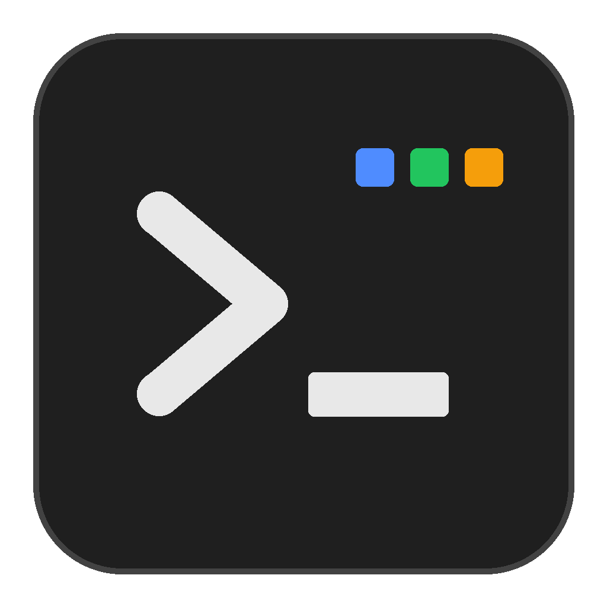

# OmniTerminal

A terminal manager for Windows where every terminal has its own logins, settings and history,
and keeps running after you close the window.

[](https://github.com/shklala/omniterminal/actions/workflows/ci.yml)
[](https://github.com/shklala/omniterminal/releases/latest)

[](LICENSE)

[Download](https://github.com/shklala/omniterminal/releases/latest) ·
[What it does](#what-it-does) ·
[Supported tools](#supported-tools) ·
[How it works](#how-it-works) ·
[Building](#building-from-source)

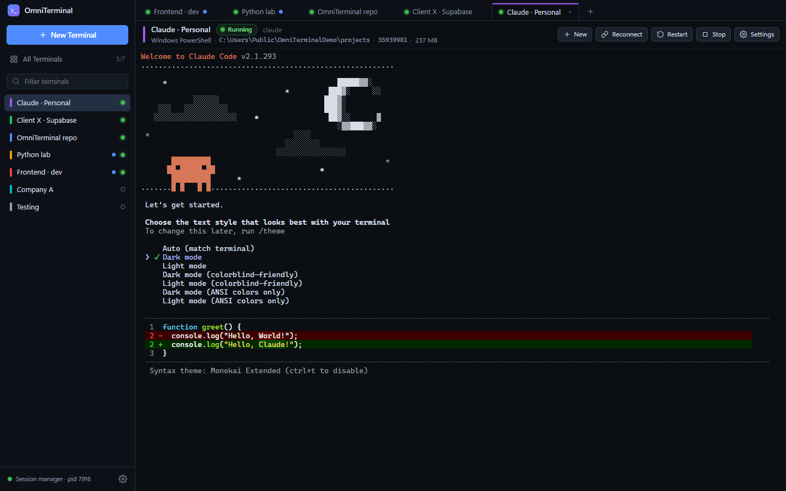

</div>

## Why I built it

I use several accounts for the same tools: a personal and a work Claude account, different Google Cloud projects,
more than one GitHub identity. In a normal terminal, logging in to one of them changes it everywhere, because the
login is stored in one place in your user folder.

In OmniTerminal each terminal stores those logins in its own folder. Log in to Claude Code in "Client A" and your
"Personal" terminal is still logged in as you. The terminals are ordinary Windows shells (PowerShell, Command Prompt,
Git Bash, WSL) with full access to your files and tools. Nothing is sandboxed.

## What it does

**Separate accounts per terminal.** Claude Code, gcloud, GitHub CLI, Git, Azure, kubectl, npm, Codex and more each get
their own config folder inside the terminal. Tools that keep a single global login (Supabase, Netlify, Fly.io,
Cloudflare and others) get a per-terminal token field instead. Secret values are encrypted with Windows DPAPI and never
shown, logged or exported.

**Sessions that outlive the window.** A small background process owns the shells. Close OmniTerminal while a long task
runs, open it again later, and the screen is exactly as you left it, including full-screen programs like `claude` or
vim.

**Reopen after a restart.** If Windows restarts, terminals that were running start again automatically, with their
earlier output shown above. Programs inside them start fresh; Claude Code users can use `claude --continue` as the
startup command to pick up the last conversation.

**More than one shell per terminal.** `Ctrl+Shift+D` (or *Open another*) opens a second shell that shares the same
accounts and variables, like opening a second window of the same terminal.

**Administrator when needed.** *Run as Administrator* restarts a terminal with admin rights through Windows' built-in
`sudo`. If a command fails with "Access is denied", OmniTerminal offers to continue as administrator. Windows always asks
first.

**Themes.** Dark, Light, Midnight and Nord for the app, or follow the Windows setting. Fourteen terminal colour schemes,
plus a theme editor for your own: every colour, and an optional background picture.

**English and Arabic.** Arabic uses a full right-to-left layout.

**Suggestions while typing.** In PowerShell, matching commands from that terminal's own history appear in a list as
you type; pick one with the arrow keys, press `F1` for help on a command. Needs PSReadLine 2.1 or later (PowerShell 7
has it; on Windows PowerShell run `Install-Module PSReadLine -Scope CurrentUser -Force` once). Tab completion works as
usual in every shell.

**The rest.**
- Command palette (`Ctrl+Shift+P`), find in output (`Ctrl+Shift+F`) and zoom.
- Live memory use per terminal, and a dot on a tab when a background terminal needs attention.
- Drag to reorder, duplicate a terminal without its logins, and import/export settings (secrets are never included).

## Screenshots

| | |
|---|---|
| 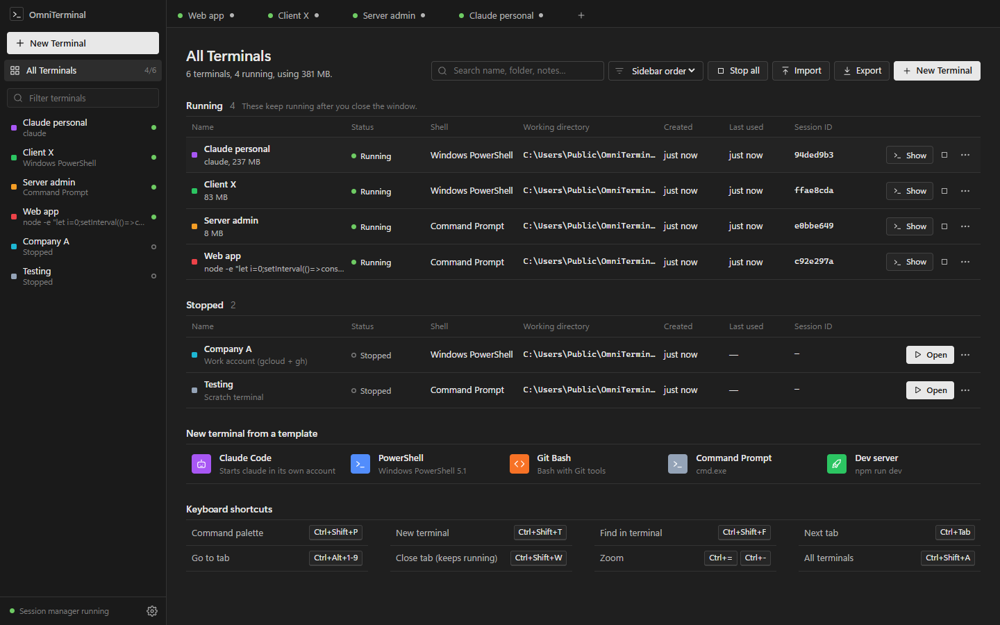 | 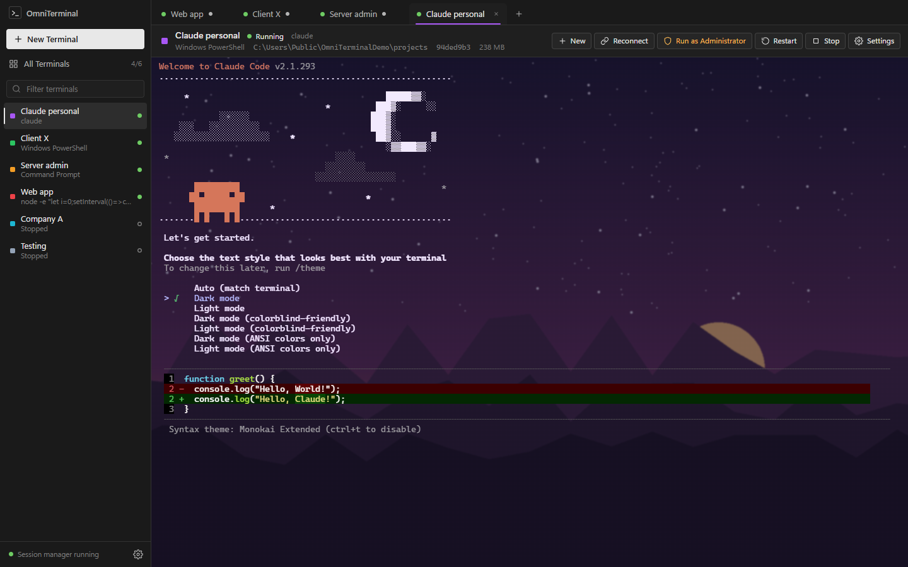 |
| All terminals, with memory use | A custom theme with a background picture |
| 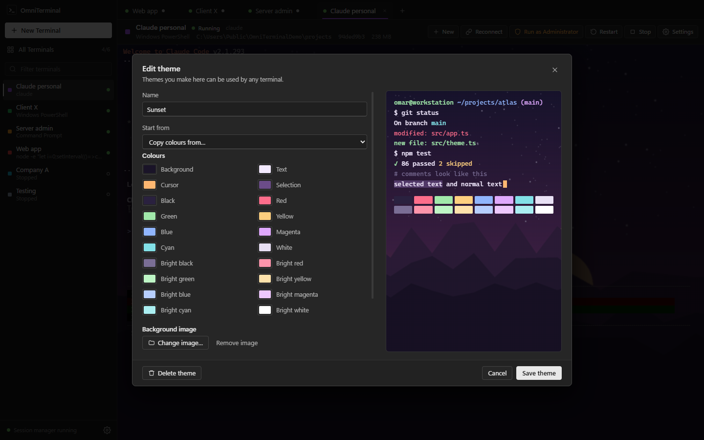 | 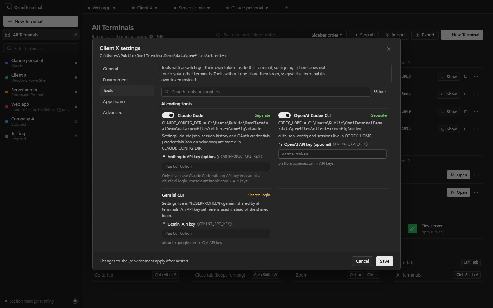 |
| The theme editor | Per-terminal tools and tokens |
| 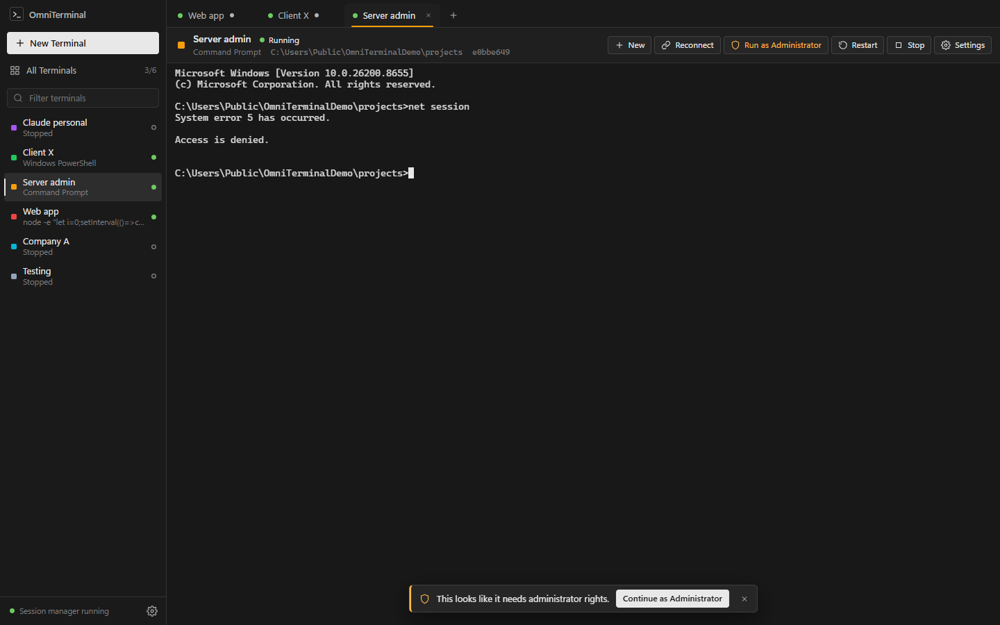 | 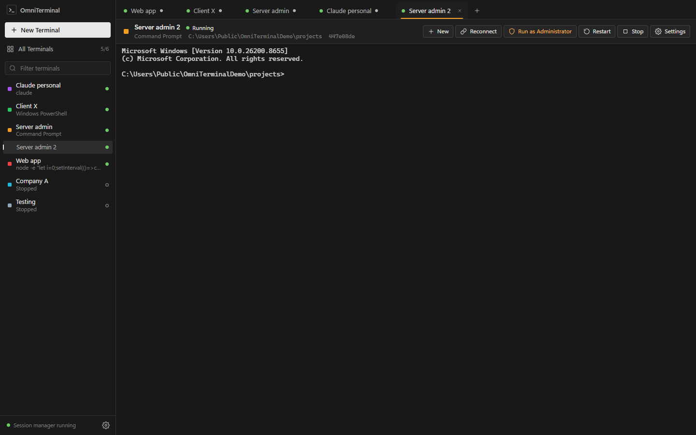 |
| Offering administrator rights after "Access is denied" | A second shell of the same terminal |
| 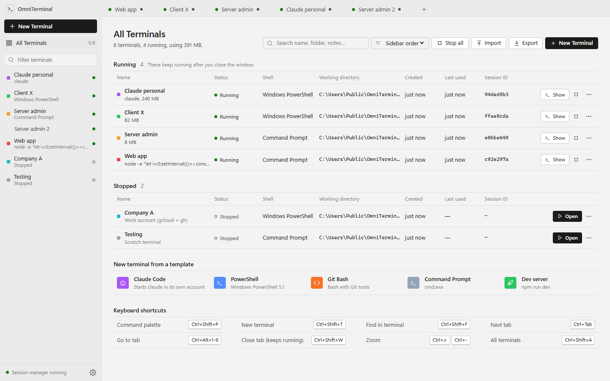 | 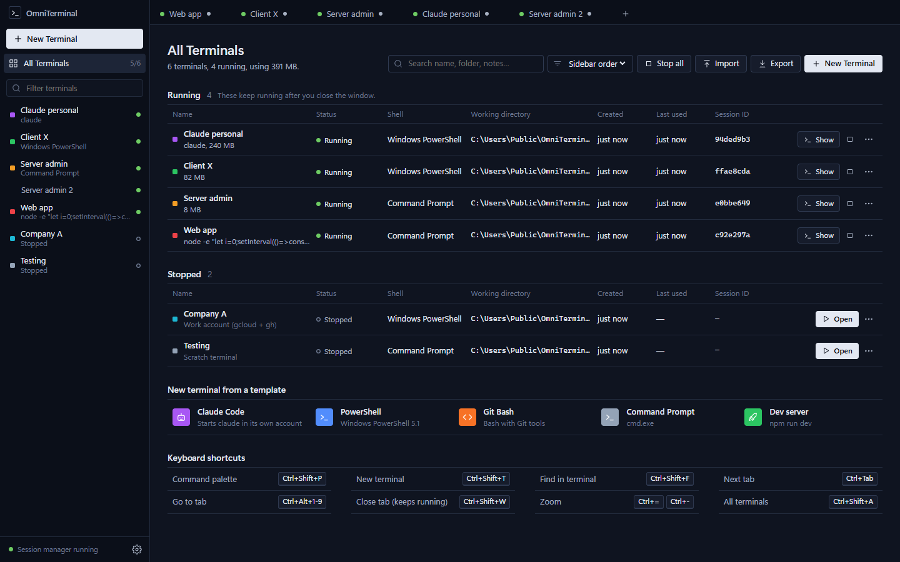 |
| Light theme | Midnight theme |
| 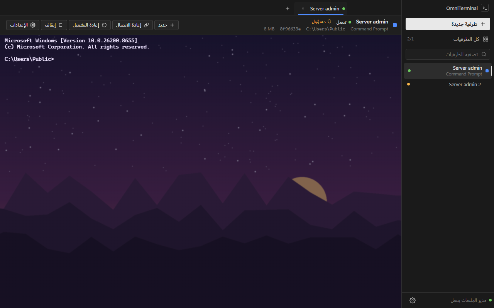 | |
| Arabic, right to left | |

## Install

Get the latest version from [Releases](https://github.com/shklala/omniterminal/releases/latest):

- `OmniTerminal-Setup-<version>.exe` installs for your user only and needs no admin rights.
- `OmniTerminal-<version>-win-x64.zip` is portable. Unzip it anywhere and run `OmniTerminal.exe`.

The builds are not code-signed yet, so Windows SmartScreen may warn you the first time. Choose **More info**, then
**Run anyway**.

Requires Windows 10 1809 or later, or Windows 11 (x64). *Run as Administrator* inside a terminal needs Windows 11 24H2
or later, which includes `sudo`.

## Using it

1. Click **New Terminal**, give it a name, pick a folder and a shell. Templates are available for Claude Code,
   PowerShell, Git Bash and a dev server.
2. It opens straight away with its own config folders ready.
3. Sign in to your tools inside it. Other terminals are not affected.
4. Close the window whenever you like. The terminals keep running until you stop them or choose
   **Exit completely** in the application settings (gear icon).

Keyboard shortcuts:

| Keys | Action |
|---|---|
| `Ctrl+Shift+P` | Command palette |
| `Ctrl+Shift+T` | New terminal |
| `Ctrl+Shift+A` | All terminals |
| `Ctrl+Shift+D` | Another shell of the current terminal |
| `Ctrl+Shift+W` | Close the tab (the terminal keeps running) |
| `Ctrl+Tab`, `Ctrl+Alt+1` to `9` | Switch tabs |
| `Ctrl+Shift+F` | Find in output |
| `Ctrl+=`, `Ctrl+-`, `Ctrl+0` | Zoom |
| `Ctrl+C`, `Ctrl+V` | Copy when text is selected (otherwise interrupt), paste |

## Supported tools

Each terminal points these tools at its own folder or token. Open a terminal's **Settings** (top bar) and the **Tools**
tab to switch tools on or off, paste tokens, or add your own mapping for anything with a config-folder variable.

| Kind | Separate config folder | Per-terminal token |
|---|---|---|
| AI coding | Claude Code, Codex | Anthropic and OpenAI API keys, Gemini CLI |
| Code hosting | Git (including Git Credential Manager logins), GitHub CLI config, GitLab CLI | GitHub token, GitLab token |
| Cloud | gcloud, Azure CLI, AWS CLI config, kubectl, Docker, Helm, Terraform settings, Pulumi, Oracle Cloud | DigitalOcean, HCP Terraform, Pulumi, Azure DevOps |
| Hosting and deploys | | Supabase, Netlify, Fly.io, Cloudflare, Railway, Heroku, Expo |
| Developer services | | Stripe, Sentry, ngrok |
| Packages | npm, pip | Cargo (crates.io), Deno |
| Data and ML | Databricks, Kaggle, Hugging Face | Hugging Face |
| History | PowerShell, Bash, Node and Python history | |

What can't be separated, so you know:

- **SSH.** OpenSSH always uses `%USERPROFILE%\.ssh` and the shared ssh-agent.
- **GitHub CLI's default login.** It goes into Windows Credential Manager, which is shared. Use the token field or
  `gh auth login --insecure-storage` instead.
- **AWS SSO token cache.** It always lives in your user folder.
- **Linux tools inside WSL.** They use the distribution's home folder.
- **Tools without a config-folder variable.** These keep using their usual location. OmniTerminal doesn't change
  `HOME` or `USERPROFILE`, because that breaks too many programs.

## How it works

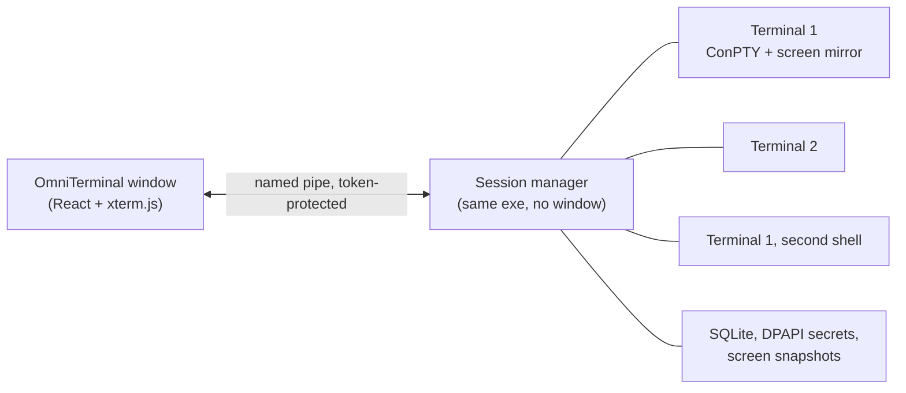

**Background process.** The window is only a viewer; a background session manager owns every shell. The manager
starts without inherited handles and outside the window's job object, so closing or crashing the window doesn't
touch your terminals.

**Screen mirror.** Each shell has a headless terminal mirror in the manager. Reconnecting replays an exact snapshot
of the screen and scrollback, then streams live output. A redacted copy of each screen is saved every 30 seconds so
it can be shown again after a restart.

**Crash and restart safety.** After a crash or restart, leftover processes are stopped only when both their PID and
start time match the record, so a reused PID never hits an unrelated program. Settings are stored in SQLite (Node's
built-in engine, WAL mode) with a backup copy. Each terminal also writes a `metadata.json`, which can rebuild the list
if the database is lost.

**Data on disk.**

```
%LOCALAPPDATA%\OmniTerminal\
  omniterminal.db             terminals, settings, session records (no secrets)
  themes\                     background pictures for custom themes
  profiles\<terminal>\
    config\                   claude, gcloud, github, git, azure, npm, ...
    credentials\              DPAPI-encrypted variables and tokens
    history\  logs\  cache\   history, logs, last screen snapshot
```

### Footprint

Version 1.2.0 measured against 1.1.0 on the same machine, with five terminals open:

| | 1.1.0 | 1.2.0 |
|---|---|---|
| Installer | 116.9 MB | 92.5 MB |
| Installed | 404 MB | 298 MB |
| Memory (private, whole app) | 493 MB | 382 MB |

How the savings were made:

- Only the visible tab uses WebGL.
- Built-in SQLite replaces a WebAssembly copy.
- The output worker in each terminal runs with tight memory limits.
- Unused Chromium language packs and the WebGPU compiler are left out.

## Building from source

```powershell
git clone https://github.com/shklala/omniterminal.git
cd omniterminal
npm install
npm run dev        # development build with its own data folder
npm test           # 93 unit and integration tests
npm run test:e2e   # drives the real app window
npm run dist       # installer and portable zip in .\release
```

Built with:

- Electron 44, React 19, TypeScript and Vite
- node-pty (ConPTY) and xterm.js
- Node's built-in SQLite
- Windows DPAPI

The tests run real ConPTY shells, real DPAPI encryption and a real background manager over the named pipe. They cover:

- separate accounts across simultaneous terminals
- reconnecting after the window closes
- crash and restart recovery with restored output
- several shells per terminal, administrator commands, custom themes
- path and secret safety

<details>
<summary>Project layout</summary>

| Area | Path |
|---|---|
| Window UI | `src/renderer/` |
| Terminal view | `src/renderer/terminal/terminalHost.ts` |
| Session manager | `src/daemon/` (`sessions/`, `pty/`, `server.ts`, `service.ts`) |
| Terminal profiles | `src/daemon/profiles/` |
| Secrets | `src/daemon/credentials/` |
| Tool list | `src/shared/tools.ts` |
| Translations | `src/renderer/i18n.ts` |
| Windows integration | `src/daemon/windows/`, `src/main/` |

</details>

## Planned

- Split panes
- Code signing and automatic updates
- Per-terminal SSH keys
- More languages

## License

[MIT](LICENSE), Omar Mohamed Fawzy
